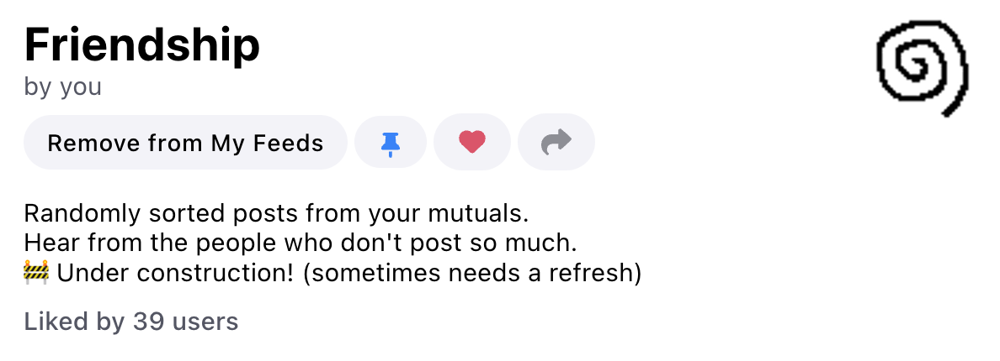

> The old world is dying and the new world struggles to be born.

The past few years,  I have been processing a degree of grief watching Twitter fall apart and my friends fragment into different areas of the internet. 

It isn't pretty to watch,  but I remind myself that endings are also opportunities. We are in charge of the future we want to build and can't abdicate that to someone else. I've been finding a lot of hope and inspiration from the experiments taking root in the space left open by a dying twitter. (Follow me on [mastodon](https://elk.zone/mastodon.social/@maxbittker)!)

Bluesky is one experiment that I've been following with a lot of interest. I like that they're prioritizing  simplicity and snappiness on the surface,  with thought-out capabilities underneath. It's still very early days,  but the project's vision of giving users a credible "right to exit" through portable data,  as well as making major components of the experience customizable has made me feel cautiously excited. 

An example is Bluesky's system for [custom feeds](https://blueskyweb.xyz/blog/7-27-2023-custom-feeds). To understand it: you might be aware of the two feeds built into Twitter: 

"Home": algorithmic engagement-bait  

"Following": spammy, live, manually curated

Bluesky has a few built-in feeds that are similar: "Discover" and "Following" — But they also have a system that allows for *any* user to design and host their own arbitrary feed of posts,  and to share that feed *through the app* in a way that allows it to be easily publicized and adopted. This chance to wrestle back some control over my social media feed algorithm has absolutely captured my interest. 

I struggle a lot with my phone usage. While I enjoy instagram as a way to connect with people I care about (mostly through Stories),  I get sucked into Insta's algorithmic feed (Reels) in a way I deeply resent. Beyond just the addictiveness of Reels or the dark patterns they use to funnel you there from other surfaces in the app,  I also find that the algorithm that they tune to show me addicting content is particularly... evil.

Instagram might show me some cool animal videos and jiu jitsu techniques,  but it also shows me mean-spirited contents that prey on my insecurities and proclivities in a way that is distinctly emotionally anti-nourishing and unhealthy. I would like to cut this out of my media diet,  but I still feel the need to stay connected to friends via Stories and DMs. Instagram is actively obstructing my ability to make choices on what is right for me. (The best solution I've found is to uninstall the iOS app from my phone and view peoples' stories through the blessedly janky and hence less-addictive web interface.)

## Design and goals 

Back to Bluesky — with the option to imagine my *own* feed on Bluesky,  I have to think about what I want to see! Which means asking myself,  what my hopes and values actually are when it comes to social media,  as well as facing the challenge of realizing those goals under the constraints of what I can encode as an algorithm. 

I like to figure things out by building,  and so I've been getting my hands dirty this past week digging into Bluesky development and hosting my first feed experiment,  which I am very proud of: the [Friendship feed](https://bsky.app/profile/did:plc:wmhp7mubpgafjggwvaxeozmu/feed/bestoffollows)!

Friendship feed's algorithm is very simple. It creates a list of your "Mutuals",  shuffles them,  and then choses a random post from each person from their most recent 5 posts. The effect is distributing your attention more evenly across your friends. I think it is effective in lending visibility to the speech of those who post more rarely. 

> "This feed is neat! It helps you catch postes from besties who don't post often that you'd likely miss otherwise" -@gretatyevka

>"this works surprisingly well 👀" -@raymondl

>"i was able to see some excellent posts from people i had probably missed because they got drowned out :)" - @kayserifserif.place

>"This is really nice. I found posts from a couple people I didn’t know were active on here because they only post once every few weeks. I’ve been getting sick of seeing just the most frequent posters." - @maxhawkins

"Friendship Feed" is in some ways an anti-algorithm. Typically,  social media sites are optimizing for your engagement time and work hard to show you the most eyeball-catching feed they can muster. Inevitably,  this over-represents content that is attention grabbing enough to get "picked up".  Even on the classic Following feed on Twitter,  billed by some as "non-algorithmic",  I miss the updates from friends who log on rarely or at odd hours. 

This isn't the distribution I want! I care about what all my friends are saying,  and want to see them,  whether they're posting once a minute or once a season. 

I think a lot about the way visibility is mediated by digital communication. On apps,  the only way to be seen is to speak. Silence is a meaningful form of communication,  but it's not one that social media apps have any patience for. Apps want you to put on good face,  to be happy and desirable — or at least loud. 

During the pandemic,  a lot of my friends were having a hard time,  and the way that tends to look on social media is going silent.  Instagram and twitter have 100 ways to surface the people who are having a great time,  and utter invisibility for those who are not speaking. There is no empty chair at the table or empty columns on the chore chart. I think's important to have the chance to pay attention when people disappear. 

I want the relationships in my life to be mediated by a medium that has space for silence.

## Next Experiments

I'm keen to hear from users of Friendship feed on how it feels to use or how it could work better. For instance,  it might be interesting to start to delve deeper into people's back-catalogues once they haven't posted in a while. Or find a way for people to "snooze" accounts out of their friendship feed (UI affordances in feed engineering often require creative hacks).

I'm also working on another feed that gets towards a more outwardly-facing mode of social media — finding visual inspiration and surfing vibes. 

## Technical Reflections 

Getting this running was surprisingly challenging,  and stretched my dev-ops and sysadmin skills outside their comfort zone. I love learning but wouldn't have minded learning a lot less in order to build this feed.

The most surprising aspect of the process was that,  because of Bluesky's decentralized architecture,  you need to do heavy data lifting — subscribing to the raw data firehose of events,  maintaining a database of the ones you care about,  as well as requesting their servers for historical repo data to backfill for old events. 

One way to put it is that the intensiveness of running a feed scales with the number of users on Bluesky,  as much as it does with the number of users who use your feed. 

In the end,  after a lot of advice from smart friendly folks on the "Bluesksy Api Touchers" discord and from gpt-4,  I have a Postgres + Go + Nginx setup on my $21/mo Digital Ocean Server with 2 GB Ram and 2 vCPUs that can keep up with the firehose. Someone else might be able to squeeze that onto a smaller or cheaper setup,  but I'm happy and proud for the time being. I'm certain it will break when bluesky grows in the future or if too many people subscribe to it.

I expect that in the future,  infrastructure will pop up that provide Bluesky data in a more digestible form for people who would like to experiment with algorithms without so much hard core engineering. It's also yet to be seen how people will fund their feeds or offset the costs.

If you're me from one week ago,  my advice is: 
- over-invest in iteration workflow feedback (the faster you can try things,  the faster your failures are,  the faster you learn)
- over-invest in measurement and system inspectability 
- communication is the best way to learn (Thanks agin to the discord and to my friend Ryan Murdock for lending moral support on debugging my database indexes)
- screw ORMs,  it's less of a headache to just to write your SQL with gpt-4

Thanks for reading! Enjoy Friendship Feed!