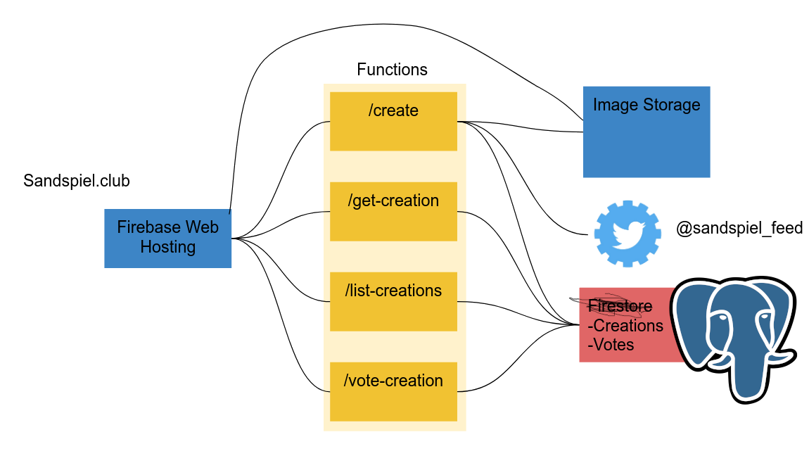

[Sandspiel](https://sandspiel.club) is a falling sand game I built in late 2018. I really enjoyed writing this game, and wanted to put into writing some of my goals, design decisions, and learnings from that process. If you're reading this and but you haven't played sandspiel, you should probably [go try it](https://sandspiel.club)!


## I love falling sand games.

If Sandspiel is the first "falling sand game" you've played, it's important to understand that it fits into a genre of games, independently developed, which are usually distributed as free webgames in the form of flash or java applets. In each game, you're given a pallette of virtual solids, liquids, and gasses, and it's up to you to paint them onto the screen to discover how they interact.


I think that I love these games so much because their mode of play is creative in a way that activates many parts of your imagination. Playing with the elements means asking questions, building experiments, and inventing stories and games of your own.

> "What does fungus do?"

> "Let's make a cool volcanic island!"

> "Does anything destroy lava?"

> "What happens if I do _this_?"

In sand games, just like in other cellular automata (such as the _Game of Life_), the behavior of any single element is very simple. The interactions _between_ the elements and across the space is where the depth of the system unfolds. The result is a system with suprising depth and variety to explore.

It's also important that this system is engaging not just for it's complexity, but also because of the ways your imagination sees reality reflected in it. Predicting how a scenario will play out based on your physical intuition is a form of play, as is visualizing imaginary versions of what you see represented on screen. Much like playing with dolls or other simplistic simulations, pouring some yellow pixels onto some green ones can invoke a scene in your mind far more vivid than what happens on the screen.

> "Low-fidelity art is also appealingly open to interpretation. If a character is only eight pixels tall, a large part of what we see is within our own imagination." - Loren Schmidt

<figure>

  <figcaption><a href="https://candle.itch.io/flotsam"><i>flotsam</i> by mark wonnacott<a/></figcaption>
</figure>

### Microcommunity

Every loves to opine on their forgotten, weird corners of the internet, and mine is the upload gallery of dan-ball.jp's Powder Game around 2007-2013. There was a beautiful micro-culture of people making games, toys, demos, propaganda, and art.

Powder Game's upload galleries were a special place -- the accessible venue to build something and share it led to people inspiring each other, riffing, and pushing the game in incredible directions! Sand games captured my free time and imagination throughout my childhood in large part because of this weird community.

It's also important that this system was built right into the game -- every player had a immediate audience for their creation, in contrast to a culture built around a few famous youtubers or streamers, or even that peculiar sort of self-selecting community you find on enthusiast forums. There was a wide variety in complexity and motivations among posters. All this with no comment section!

Three archetypes of upload I remember fondly:

Games for the player, often with empty promises of some reward for voting.


Grotesque "Don't Smoke" educational demonstrations. (I think these were directly fueled by children coming home after D.A.R.E. programs at school)


Cool volcanos. (a real classic)


Beautiful pixel-art architecture to destroy.


The added dimension of an audience brings so much depth to playing around with sand. I wanted to facilitate this in sandspiel with the upload system.

## Building Sandspiel

The first thing you should know is that Sandspiel is actually my third or fourth attempt at building an interactive falling sand simulation.

### "HTML5"

The first proper attempt was pure javascript in 2015. [(You can try it out here!)](https://maxbittker.github.io/dust/)


It's... a falling sand game! You can set things on fire, draw fountains, and there's even a fluid simulation that allows particles to float around in the wind. I think my favorite things about this game was making pixel art with the rainbow "Dust" element, and the way that "Dirt" absorbs and diffuses water to become mud.

On the negative side, resolution is only 100x100 (Sandspiel has 9x more pixels), doesn't work on a phone, the interface is confusing and keyboard based, and the element logic is pretty janky.

It's also rendered with canvas APIs, and the code is not organized in any intentional way. Plenty of dynamic typing, squishy abstractions, gnarly switch statements, and global variables. All of this made implementing and debugging each successive element's logic increasingly difficult-- to the point that it resulted in bugs that I domesticated and kept in the game, such as the element "Glitch" which behaves differently depending on what element you have selected.

I was really proud of this game and had a great time building it, but it followed the familar arc of a system collapsing under its own weight as progress became more difficult and motivation waned. The last commit message was kind of classic, and I never did follow up on that "impending refactor".


###LÖVEly
The [second approach](https://github.com/MaxBittker/sand-toy) was with Lua in 2018, and my work here turned out to be the direct prototype for Sandspiel.


A few things are briefly worth saying on this experience:
First I need to gush that lua is super fast thanks to LuaJIT, and the [LÖVE](https://love2d.org/) framework is lovely tool for building games.
Shaders, input handling, update and render loops -- everything clicked together thanks to LÖVE and made life easy - I could get things running quickly with minimal yak shaving and boilerplate.
Coming from the browser, a tool into which I have personally sunk _hundreds_ of hours learning APIs, edge cases, and performance characteristics, it was a big surprise to see how effective a minimal programming environment for building games could be. So much complexity that we put up with is due to legacy and sunk costs!

  <figure>
<video muted controls width="100%" autoplay="true" loop="true" name="lua video" src="lua.MOV"></video>

  <figcaption>First vaugely working moment of the lua demo</figcaption>
</figure>

Coming into this second attempt to build a sand game, I had 3 years of experience beyond what I had when building the pure javascript version. I also had an important new goal - not only did I want the game to be fun to play, but I also wanted elements to be fun to _write_.

I approached the project with a focus on the ergonomics of defining elements with code because I was imagining a new type of sand game with a fully sandboxed programming interface that would allow people to not only paint and share their compositions, but also to _code their own new elements_ and share those too!

My hope was that a community of people collaborating to build a plethora of weird elements would find really interesting interactions that hadn't been covered in other sand games.

However, this was a big goal, and the first step of the process was still building out a game engine and initial set of elements on my own. While building these, I was thinking carefully about the needs of the future element authors. Viewing the game engine as a public API meant designing it to move as much complexity as possible inside the engine and away from being the responsibility of the individual elements.

```lua
-- implementation of the rules for the "Gas" element, in lua
function updateGas(particle, getNeighbor, setNeighbor)
    local d = {x = math.random(-1, 1), y = math.random(-1, 1)} -- random location offset
    if (getNeighbor(d) == species.empty) then -- if that relative location is empty
        setNeighbor({x = 0, y = 0}, species.empty) -- write "empty" to my current location
        setNeighbor(d, particle) -- and write my particle type to the random offset
    end
end
```

This meant defining a format that elements were expressed in -- I settled on a single update method which defines the behavior of a single particle for a single update tick. The code inside the method can interact with the system only via special methods which provide safe reading and writing to their neighbors.

This API abstracts away concerns such as:

- The particle needing to know its absolute position (`setNeighbor` and `getNeighbor` deal in relative offsets),

- Interactions with the edges of the grid (all of the edge condition logic is in the engine),

- Enforcing a small local read/write neighborhood for the particles (no "action at a distance").

That work relieved the individual elements from needing to take on these concerns into their own logic, and made the system more consistent and easier to experiment with as I implemented my cast of elements.

Focusing on making the definition of a new element simple and self-contained really paid off, even though I ultimately ened up being the only person consuming these APIs. The system being more fun to iterate on was rewarding enough to justify the extra care put into the architecture early on.

Ultimately, I was excited about this approach and it was working well, but wanted to build on a platform where I could reach users. Despite everything good I had to say about LÖVE, the web is too powerful of a platform to pass up, and it's worth the quirks and warts.

I decided to put down the lua implementation and switch to Rust, but I was able to directly translate many lessons and patterns over. Having a good idea of what my datastructures would be and what types of APIs would be defined between components made writing the Rust version much smoother.

Implementing one idea multiple times was a huge strength in my ability to structure my codebase, forsee pitfalls, and make more thoughtful and intentional tradeoffs. I would strongly recommend this experience to anyone - If you have a project that you've attempted in the past but either didn't finish or made compromises on due to your technical skills or endurance, taking another crack at it can a great opportunity to sweat the details and see new approaches.

### Architecture:

Sandspiel.club can be described as four main components

- the particle simulation code, writen in Rust
- a fluid simulation, written in JS & GLSL
- user interface written in React & JS
- a CRUD backend written with TypeScript and ~~Firebase~~ Postgres

The main simulation, controlling the movement and interactions of all of the elements, takes place in Rust in a class called Universe. This is the class holds the game state and exports a set of methods to be called by the Javascript application, which do things like process a frame of the simulation, paint some pixels, or return a pointer to the particle state buffer.

This means that I don't try to handle an event loop, do rendering, or interact with the browser from inside the Rust code - all of that would be perfectly possible, but I'm very happy with this division of labor between the JS and Rust. Everything low level or CPU intensive happens within the Rust-generated Web Assembly code, while all of the the glue related to human interface, WebGL calls, and browser APIs takes place in the Javascript.

#### Data format

The first most notable aspect of Sandspiel's architecture is the compact data format I used for the game state. By setting some constraints on the system, I was able to benefit from a uniform format that performed and serialized well. This came in handy several times!

The state for a single particle is represented as a 32 bit struct.

```rust
#[repr(C)]
pub struct Cell {
    species: Species,
    ra: u8,
    rb: u8,
    clock: u8,
}
```

The first field, `species`, is a custom enum type which represents the varieties of particles as numbers:

```rust
#[wasm_bindgen]
#[repr(u8)]
pub enum Species {
    Empty = 0,
    Wall = 1,
    Sand = 2,
    Water = 3,
    ...
    Seed = 19,
}
```

`ra` and `rb` are two 8 bit registers for storing extra some cell state beyond species, such as what color a given flower petal is, or how hot an ember of fire is. They're used in different ways by different element species, and some species don't use them at all (for instance, Wall has no extra state to track). The two state registers only differ in that ra is initialized to a random value, and rb is initialized to 0. Register A is also used in rendering to determine how light the pixel should be, which is where the slight grain effect comes from.

`clock` is just used to prevent a single particle from being simulated multiple times in a single tick if it moves in the same direction as the update scans. Because we execute cell update functions one at a time from left to right and top to bottom, if a particle something is moving down, it will keep bumping itself ahead of the "scan line" and could move many spaces in a single frame. Clock is meant to keep track of what elements have been simulated already - this could have been accomplished single bit that is flipped back and forth but it's important that my Cell type is represented by a total of exactly 32 bits, and I didn't have any use for the other 7 bits!

Nowhere in this cell state struct is a concept of location. This is because, as opposed to a particle simulation where we maintain a list of entities and their positions, here we store all particles in a dense 2D array, and directly encode the position of a cell as its location in that grid.


### Update Function

The most important pieces of code in the game are the set of functions, one per element type, that define how each particle interacts with its neighbors each frame. Theoretically, you could delete these functions (which live in [species.rs](https://github.com/MaxBittker/sandspiel/blob/master/crate/src/species.rs) ) and write a new set that transform the game into a cellular automata simulator for some other system, such an ant farm, a petri dish, a cityscape, a paint canvas, an aquarium, or an abstract fractal playground.

Here's an example of how one of our elements is defined:

```rust
// Called once per sand particle per frame:
pub fn update_sand(cell: Cell, mut api: SandApi) {
    let dx = rand_dir(); // random value in {-1, 0, 1}
    let neighbor = api.get(0, 1); // get the Cell Struct of the cell below me

    if neighbor.species == Species::Empty { // try to fall down
      api.set(0, 0, EMPTY_CELL); // erase my current location
      api.set(0, 1, cell); // write myself one cell lower
    } else if api.get(dx, 1).species == Species::Empty { // try to fall diagonally
      api.set(0, 0, EMPTY_CELL); // erase my current location
      api.set(dx, 1, cell);  // write myself down and to the side
    }
}
```

`SandApi` is a struct that holds the location of the element in a way that is transparent to the update function. It has two important functions: `get` and `set`, which accept relative coordinates and let you read and write to your neighboring cells. For instance, `api.get(0, 1).species` tells you the species of the particle below you, and calling

```rust
api.set(0, 0,
   Cell {
      species: Species::Fire,
      ra: 150,
    }
  );
```

will write a `Fire` particle to your current location (erasing yourself in the process).

Designing and tuning these update functions was a lot of fun, and I was able to test out a lot of ideas and play with different interactions. I didn't make use of syntax macros or anything as fancy as that, but the experience was a lot like that of building a system by first building a "Domain Specific Language" which encodes the shared behaviors and invariants of the system, and then scripting its inhabitants in that simplified DSL.

Another thing to note here is that the update methods, which hold so much of the gameplay logic, are run thousands of time per frame! This means that they're simultaneously critical to the feel of the game, _and_ are some of the hottest lines of code in the project. Rust's commitment to enabling expressive, high level code without invisible performance cliffs really allowed me to write the logic how I wanted to write it, without accidentally causing a bunch of slow heap allocation or writing code that a JIT will capriciously decide not to optimize. It's probably possible that there are people out there who could carefully craft some high-performance javascript that would be competitive with my Rust code, but I was able to mostly "just code" and not worry too much about performance.

Zero cost abstractions!

Last interesting anecdote here is that I unwittingly wrote most of the game with my rustc optimization strategy on “z”, which means the compiler will optimize for binary size. Once the project was almost finished, I realized this and switched it to "o3" which does things like inlining and gave me a big performance boost, where I had been being frugal! That was a nice surprise, it performed better and the WASM output only increased in size from 66Kb to 84Kb.
A big mistake I made was to immediately take this extra performance budget and "spend it" to increase my canvas size from 250x250 to 300x300, because now I could still get 60 fps on the 300x300 canvas.
This was a blunder because there are a ton of devices which can't run sandspiel at 60fps, and I should have held onto this spare performance headroom so that more devices could run the simulation at full speed.

### Rendering

I mentioned that the simulation takes place in Web Assembly, and that the Javascript manages the WebGL rendering (it's [totally possible to call WebGL APIs directly from web assembly](https://rustwasm.github.io/wasm-bindgen/examples/webgl.html), but I didn't want to compound my WebGL inexperience with my Rust inexperience).

Rendering is basically as easy as reading each cell of our gamestate grid, and painting a corresponding pixel with a color according to its `species` and `ra` values.

We just need to make sure that our fragment shader (the code which runs on the GPU and decides what color the pixels should be) has access to the game state, which is stored in the Web Assembly heap.

In order to move the game state from Web Assembly to WebGL, we construct a [Javascript typed array](https://developer.mozilla.org/en-US/docs/Web/JavaScript/Typed_arrays) _view_ over the game state array which lives in Web Assembly memory, and pass that view to our fragment shader (GPU code) as a texture.

```javascript
// Typed Array is not a copy, it's a view of our web assembly array
const cellsData = new Uint8Array(
  memory.buffer,
  universe.cells(), <- // a pointer to the Cell array in WASM
  width * height * 4
);

gl.bindTexture(gl.TEXTURE_2D, cellTexture);
gl.texImage2D(
  gl.TEXTURE_2D, 0, gl.RGBA,
  width, height, 0, gl.RGBA, gl.UNSIGNED_BYTE,
  cellsData
);
```

Because our game state data is arranged in such a way that it happens to be a valid image texture, we can ship the whole grid over to the GPU with minimal copying and allocation! This was a big deal for making Sandspiel's rendering performant- the rendering code blocks the CPU for less than 1 millisecond, critical for meeting the strict 16ms budget needed to achieve 60FPS.


This is also one of the reasons it was so important that our Cell state was stored as an array of 4 byte chunks. WebGL has a lot of restrictions on the formats of data that can be used in textures, but RGBA textures where each pixel is 4 unsigned bytes are well supported.

### Fluid Dynamics

Sandspiel's fluid simulation usually really stands out to people who play with it, which makes me feel a little bit guilty, because it's largely ripped from [Pavel Dobryakov's WebGL Navier-Stokes implementation](https://github.com/PavelDoGreat/WebGL-Fluid-Simulation). I'm extremely grateful to have had such a quality implementation to learn from-- adapting and extending this code was the most personally challenging technical hurdle I faced building the game.

Adapting the code was difficult because, in order to have interactions between the wind (simulated on the GPU) and the particles (simulated on the CPU), I needed to pass data from Web Assembly to WebGL (in the same fashion as I mentioned for the rendering), _and_ from WebGL back into to Web Assembly (this bit was trickier, as WebGL can by picky about which buffers are readable, and when you can read from them).

I also needed to do this in a way that used only the subset WebGL features supported on most phones - WebGl is a pretty large spec, and for hardware and driver reasons, not all of it is available on all devices.

The texture types they support required some munging, because the fluid simulation is done with floats, but to support phones I could only move data in or out of the shaders via unsigned byte textures.

There’s also a maximum # of simultaneously bound texture units of 8, and I had to plug a lot of gaps in my knowledge of how OpenGL works in order to correctly bind textures for each shader and stay under that limit.

All of this was made worse by the fact that my only phone to test code on runs iOS, and Apple only allows you to connect to the mobile safari devtools from a Mac. So I was debugging many of these WebGL device-specific limitations without so much as a console. Frustrating!

### User Interface

Sandspiel's interface is actually much simpler than most falling sand games. This was an intentional result of trying to keep the UI light and fun on a touch screen, by avoiding interactions that require multiple taps to complete. Some examples of this are that none of the tools require cycling through different settings or drop-down menus, and I dropped the system of multiple selection that other games use for elements like clone.


I also put a lot of care into the line drawing itself - there's some fiddly code handling edge cases related to taps, drags, scrolling, and other interaction events on and around the canvas. This is the sort of tuning that should be invisible if it's working, but I ran into a lot of interaction scenarios while testing the game, and tried to sand them down.
A regret is that I disabled pinch-to-zoom as part of this work.
After seeing people's intricate art, I wish I'd found a solution for interactions to be predictable and still zoomable, to let people draw at different scales. Facilitating and disambiguating multiple gestures in a single arena is a complex and fascinating corner of algorithms and human computer interaction, and I have new respect for the the work that goes into building rich touch screen experiences.

#### UI Code

I threw the interface together mostly in React. If you have one takeaway about Web Assembly from this project, I want it to be that WASM is not an all or nothing undertaking! Having the ability to put low-level and performance-critical logic into Rust and still handle all the browsery stuff, glue code, and UI in Javascript was critical to this project coming together quickly and having a nice interface.

Leveraging the npm ecosystem for tools like React, Regl, and GLSLify, as well as exercising Javascript's flexibility to toss data anywhere I needed it without much planning or refactoring enabled me patch things together quickly and loosely.

Nothing I wrote in JS would have been _impossible_ to accomplish in Rust, but it wouldn't have come together as easily and I wouldn't have been able to test as many ideas along the way.

That being said, building high quality interfaces is something I value and respect, but I definitely did phone it in for the React part of the codebase. `ui.js` is basically one huge class and the experience suffers for it. There are still a bunch of absent small touches like loading indicators, proper routing (😬), visual feedback on buttons, pagination, etc. I was really itching to release the game and didn't budget the time to do a better job. But I have no regrets. Building polished interfaces is my day job, so it feels like work, and I think what I built is good enough for now. Hopefully, I'll come re-write this when I'm feeling motivated to add some features or learn about React hooks or something.

### Sharing & Persistence

To fully capture the creative micro-community of other falling sand games, I wanted there to be functionality for uploading creations, and browsing others' works. I decided to try using Firebase to handle my backend needs, and I think that worked out pretty well! One design decision that turned out to be important was that I wanted to avoid dealing with accounts and authorization. I find that stuff annoying for the user and boring to implement so I went to some lengths to do without it.

The way that I handled data security without auth was putting all data writing inside of cloud function api endpoints, and using these to constrain what the client could do. (basically, insert and vote only, no editing or deleting of other posts). My workaround for voting deduplication was to use IP addresses, which is possible to manipulate, but I don't really care enough to try to fight it.

A cool thing here about the storage functionality is that I serialize the game state as a PNG file, which is lossless and highly compressible. Plus, browsers have PNG encoders and decoders built in, so that's more code I don't need to import and ship with my bundle.
Here's what the data looks like as a PNG: (remember, "red" is `species`, "green" is `ra`, and blue is `rb`)


The basic architecture of my backend is something like this:


There were times while debugging when I was really just wished I was writing a http server with a redis instance and a directory full of files, with nothing hidden behind proprietary services. But I don't want to be on the hook for availability and server management - especially when the [other things](https://twitter.com/NYT_first_said) running on my VPS are already fragile, stateful, and ad hoc. Firebase was harder to debug and run adhoc scripts against, but I don't have to think about it now that the service is deployed, and it's reliable and (almost) cheap enough. Running the game for all of February cost about \$45, and 98% of that was "firestore reads" which I haven't yet tried to optimize for 😬. I expect that once I re-design the browse functionality to paginate and be more frugal (it blindly pulls down 500 results, and most users probably don't look past the first 30), it will be sustainable for me to keep running for while at the current rate of traffic.

### Community

A (couple thousand)[https://simpleanalytics.io/sandspiel.club] people play with Sandspiel every day now! The upload boards get spammed with all sorts of beauty and nonsense, and it warms my heart to see people playing, interacting and (mostly) having fun. The playerbase skews pretty young, and uploads are filled with memes, kids promoting their tiktok accounts, etc etc.

People have uploaded sophisticated rube goldberg reactions, coloring book "complete the drawing" prompts, abstract art, crude graffiti, and everything in between. One upload that surpised me was when someone played with the data buffer directly, to write out-of-range species data. This resulted in an element with no defined behavior, the "MissingNo." of sandspiel.

Doonaloona
SparkyKat
Belp
glitch liquid
js api

Thanks for reading, thanks for playing!

#Resources to check out:

[The Rust Wasm Book](https://rustwasm.github.io/book/) is a _great_ succinct resource that covers all aspects of writing a hybrid JS & Rust application. I had basic rust knowledge before starting Sandspiel, but no knowledge of web assembly, and was able to follow this book to bootstrap the game. A lot of code from the book actually ended up in my game, since their example was cellular automota related.

[The Book of Shaders](https://thebookofshaders.com/) I didn't specifically reference TBoS during this project, but I take any opportunity I can get to recommend it to anyone interested in learning graphics programming. I wish this book was a part of high school math curriculums.

[WebGL Fundamentals](https://webglfundamentals.org/) & [WebGL2 Fundamentals](https://webgl2fundamentals.org/) Really solid & complete explanations of WebGL basics, put into context of common tasks and patterns. Finding those two things together is rare!

[Fast Fluid Dynamics Simulation on the GPU](http://developer.download.nvidia.com/books/HTML/gpugems/gpugems_ch38.html) is a chapter from the book _GPU Gems_, which details the math and mechanics that go into a beautiful and buttery Navier Stokes fluid simulation. It's really interesting how physical concepts like pressure, advection, and diffusion, all expressed as math operations on grids of floats, can be composed into a convincing simulation.

Also, thanks to Chris Crawford, Nikhilesh Sigatapu, Thais Correia, Pavel Dobryakov, the Rust WebAssembly working group, and ha55ii for inspiration, knowledge, code, and feedback!

#Extra links:
[sandspiel source code](https://github.com/MaxBittker/sandspiel)

[@sandspiel_feed twitter feed of uploads](https://twitter.com/sandspiel_feed)
