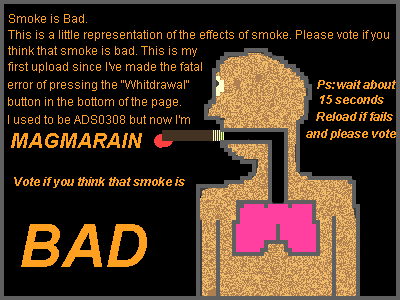

[Sandspiel](https://sandspiel.club) is a falling sand game I built in late 2018. I really enjoyed writing this game, and wanted to put into writing some of my goals, design decisions, and experiences from that process.


## I love falling sand games.

If you haven't played a falling sand game before, imagine a pixelated chemistry kit. You're given a palette of virtual solids, liquids, and gasses, and it's up to you to paint them onto the screen and discover how they interact.


I think one reason I love these games so much because their mode of play is creative in a way that activates many parts of your imagination. Playing with the elements means asking questions, building experiments, and inventing your own stories and games.

> "What does fungus do?"

> "Let's make a cool volcanic island!"

> "Does anything destroy lava?"

> "What happens if I do _this_?"

The behavior of any single element is simple, but the resulting system is rich for exploration because of the many ways that elements can interact in different combinations and configurations.

The simulation is engaging not only for their complexity, but because of the ways your imagination sees reality reflected in it. Pouring some yellow pixels onto green ones can invoke a scene in your mind far more vivid than what happens on the screen.

> "Low-fidelity art is also appealingly open to interpretation. If a character is only eight pixels tall, a large part of what we see is within our own imagination." - Loren Schmidt

<figure>

  <figcaption><a href="https://candle.itch.io/flotsam"><i>flotsam</i> by mark wonnacott<a/></figcaption>
</figure>

### Microcommunity

People love to opine on their forgotten, weird corners of the internet, and mine is the upload gallery of dan-ball.jp's Powder Game around 2007-2013. There was a beautiful micro-culture of people making games, toys, science demonstrations, propaganda, and art for eachother another to load and enjoy.

Powder Game's upload galleries were beautiful place -- the venue to easily build something and share it led to people inspiring eachother, riffing, and flexing the game in incredible directions! Sand games had so much staying power through my childhood in large part because of this weird community.

It's also important that this system was built right into the game -- every player had a immediate audience for their creation, versus a culture of a few famous youtubers or streamers, or even the sort of self-selecting culture you find on forums. There was a wide variety of complexity and motivations among posters. All with no comment section!

Three archetypes of upload I remember fondly:

Games for the player, often with empty promises of some reward for voting.


Grotesque "Don't Smoke" educational demonstrations. (I think these were directly fueled by children coming home after D.A.R.E. programs at school)


Cool volcanos. (a real classic)


Beautiful pixel-art architecture to destroy.


The added dimension of an audience brings so much depth to playing around with sand. I wanted to facilitate this in sandspiel with the upload system.

## Building Sandspiel

Sandspiel was (at least) my third go at building an interactive falling sand simulation.

[My early attempt](https://maxbittker.github.io/dust/) was pure javascript in 2015. It was slow, used canvas APIs, and was a dissorganized mess of dynamic typing, switch statements, and global variables which made implementing and debugging each successive element's logic increasingly difficult, to the point that it even resulted in bugs that I kept in the game, such as the "gitch" element. I was really proud of this game and had a great time building it, but it followed the familar arc of a system collapsing under its own weight as improving or refactoring became more difficult and motivation waned.


The [second approach](https://github.com/MaxBittker/sand-toy) was in lua, and it evolved into my work on Sandspiel. A few things are briefly worth saying on this experience.
First I want to say that luajit is super fast, and [LÖVE](https://love2d.org/) is an excellent tool for building games.
Shaders, input handling, update and render loops -- pretty much everything clicked together and made life easy so I could get the game running quickly with minimal yak shaving and boilerplate.
Coming from the browser, a tool into which I have personally sunk _hundreds_ of hours into learning APIs, edge cases, and optimizitions, it was a surprise to see how simple and effective an minimal programming environment for building games could be.


Another important aspect of this new attempt to build a sand game was that I was coming into it with several years of experience beyond what I had when building the pure javascript version. I also had an important new goal - not only did I want the game to be fun to play, but I also wanted elements to be fun to _write_.

I came in with a focus on the ergonomics of defining elements with code because I was trying to build a sand game with a fully sandboxed programming interface that would allow people to not only share their compositions, but also to _code their own new elements_ and share those!

My hope was that a community of people collaborating to build a plethora of weird elements would find really interesting design spaces that hadn't been covered in other sand games.

However, the first step of this process was still building out a set of elements on my own. While building, I was thinking carefully about the needs of the element authors. Viewing the game engine as a public API meant designing it to move as much complexity as possible inside the engine and away from being the responsibility of the individual elements.

```lua
function updateGas(p, getNeighbor, setNeighbor)
    local d = {x = math.random(-1, 1), y = math.random(-1, 1)} -- random location offset
    if (getNeighbor(d) == species.empty) then -- if that relative location is empty
        setNeighbor({x = 0, y = 0}, species.empty) -- write "empty" to my current location
        setNeighbor(d, p) -- and write my particle type to the random offset
    end
end
```

todo: make this paragraph make sense:

Making the definition of a new element as simple and self-contained as possible ultimately paid off an made the system a lot more fun to iterate on.

This meant defining a contract that elements had to follow -- they're a single update method which will be called by the system once per particle per frame, and they can interact with the system only via special methods which allow safe reading and writing to their neighbors. This API abstracts away concerns such as

- the absolute position of the particle in question (setNeighbor and getNeighbor deal in relative offsets),
- observing limitations such as how far away an element is allowed to mutate or inspect other elements from (in this case, only their direct neighbors, no "action at a distance")
- and handling out of bounds accessses.

This work relieved the individual elements from needing to take on these concerns into their own logic, and made the system more consistent and easier to experiment with as I implemented my set of elements.

Utimately, I was excited about this approach, but wanted to build in a an enviroment that would be easy to share. Despite everything good I had to say about LÖVE, the web is too special of a platform to pass up for me, and it's worth the difficulties imposed by its quirks and warts.

I decided to put down the lua implementation and switch to rust and web assembly, but I was able to translate many of the lessons and patterns over. Having a good idea of what my datastructures would be and what types of APIS would be defined between components made writing the rust version easier.

Implementing one idea multiple times was a huge strength in my ability to structure my codebase, forsee pitfalls, and make more intentional tradeoffs. _I would strongly recommend this experience to anyone_ - If you have a project that you've attempted in the past but had to make compromises on due to your technical skills or endurance, taking another crack at it can a great opportunity to sweat the details and focus on aspects that you usually don't.

### Architecture:

The bulk of the simulation, including the movement and interactions of all of the elements, takes place in Rust in a class called Universe. This is class holds the game state and exposes a set of methods that get called by the javascript application, to do things like process a frame of the simulation, paint some pixels, or pass a pointer to the gamestate buffer.

This means that I don't try to handle an event loop or interact with the browser from inside the Rust code - This is all perfectly possible, but I'm very happy with this division of labor between the JS and Rust. Everything low level or CPU intensive happens within the Rust-generated web assembly code, and all of the the glue related to human interface, WebGL calls, and browser APIs takes place in the javascript.

#### Data format

The state for a single particle is represented as a 32 bit struct.

```rust
#[repr(C)]
pub struct Cell {
    species: Species,
    ra: u8,
    rb: u8,
    clock: u8,
}
```

The first field, species, is a custom type which represents the varieties of particles as numbers.

```rust
#[wasm_bindgen]
#[repr(u8)]
pub enum Species {
    Empty = 0,
    Wall = 1,
    Sand = 2,
    Water = 3,
    ...
    Seed = 19,
}
```

`ra` and `rb` are two 8 bit registers for storing extra cell state. They're used in different ways by different element species, and some species don't use them at all (for instance, Wall). The two state registers only differ in that ra is initialized to a random value, and rb is initialized to 0. Register A is also used in rendering to determine how light the pixel should be, which is where the slight visual noise comes from.

`clock` is used to avoid a single logical cell from being simulated multiple times in a single tick if it moves in the same direction as the update scans. Because we execute cell update functions one at a time from left to right and top to bottom, if a particle something is moving down, it will keep bumping itself ahead of the "scan line" and can move many spaces in a single frame. Clock is meant to keep track of what elements have been simulated already - this could have been acomplished single bit that is flipped back and forth but it's important that my Cell type is represented by a total of 32 bits, and I didn't have a use for the other 7 bits!

You may have noticed that nowhere in this cell state struct is a concept of location. This is because, as opposed to a particle simulation where we maintain a list of entities and their positions, here we store all particles in a dense 2D array, and directly encode the position of a cell as its location in that grid.


### Update Function

The most important pieces of code in the game are the functions that determine how each particle interacts with its neighbors each frame. Theoretically, you could delete the `species.rs` file and write a new one that transforms the game into a cellular automata simulator for some other system, such an ant farm, a petri dish, a cityscape, a paint canvas, or an aquarium.

Here's an example of how one of our elements is defined:

```rust
// Called once per sand particle per frame:
pub fn update_sand(cell: Cell, mut api: SandApi) {
    let dx = rand_dir(); // random value in {-1, 0, 1}
    let neighbor = api.get(0, 1); // get the Cell Struct of the cell below me

    if neighbor.species == Species::Empty { // try to fall down
      api.set(0, 0, EMPTY_CELL); // erase my current location
      api.set(0, 1, cell); // write myself one cell lower

    } else if api.get(dx, 1).species == Species::Empty { // try to fall diagonally
      api.set(0, 0, EMPTY_CELL); // erase my current location
      api.set(dx, 1, cell);  // write myself down and to the side

    }

}
```

SandApi a struct that holds the location of the element in a way that is transparent to the update function. It has two important functions: get and set, which accept relative coordinates and let you read and write to your neighboring cells. For instance, `api.get(0, 1).species` tells you the species of the particle below you, and

```rust
api.set(0, 0,
   Cell {
      species: Species::Fire,
      ra: (150 + (cell.ra / 10)) as u8,
      rb: 0,
      clock: 0,
    }
  );
```

Will write a `fire` particle to your current location (erasing yourself in the process).

Designing and tuning these update functions was a lot of fun, and I was able to test out a lot of ideas and play with different interactions. I didn't make use of syntax macros or anything as fancy as that, but the experience was a lot like that of building a system by first building a "Domain Specific Language" which encodes the shared behaviors and invariants of the system, and then scripting its inhabitants in that simplified DSL.

One weak point that I didn't elegently solve in this design is that many of the elements have hardcoded inter-dependencies on each other. The best two examples are combustion and buoyancy. Several elements in the game have a shared behavior where they burn when exposed to fire or lava. Instead of being able writing some general purpose "flamability" behavior and compose that into the elements, each one manually checks its neighbors for being `Species::Fire` or `Species::Lava`, and reacts accordingly. This means that today I couldn't add a "Spark" species which ignites flamable material without manually editing each of these update functions. I could have encoded some of this behavior into a shared helper function, or stored some global set of properties about each species besides their update functions.

Another thing to note here is that these update methods, which hold so much of the game logic, are run thousands of time per frame! This means that they're simultaneously critical to the feel of the game, _and_ the some of the hottest lines of code in the project. Rust's commitment to enabling expressive, high level code without performance cliffs really allowed me to write the logic how I wanted to write it, without accidently causing a bunch of slow heap allocation or writing code that a JIT will choose not to optimize. It's probably possible that there are people out there who could craft some awesome high performance javascript that would be competitive with this Rust code, but I was able to mostly "just code" and not worry too much about performance cliffs. I didn't even keep formal benchmarks.

Zero cost abstractions!

Last interesting anecdote here is that I unwittingly wrote most of the game with my rustc optimization strategy on “z”, which means optimize for binary size. Once the project was almost finished, I realized this and switched it to "o3" which does things like inlining and gave me a big performance boost, where I had been being frugal! That was a nice surpise.

### Rendering

I mentioned that the simulation takes place in Web Assembly, and that the javascript manages the WebGL rendering (it is totally possible to make WebGL calls directly from web assembly, but I didn't want to multiply my inexperience with WebGL with my inexperience in Rust). The shaders need to know the state of the game in order to visualize it - so we have to get bridge that gap!

In order to move the game state from Web Assembly to WebGL, we construct a [Javascript typed array](https://developer.mozilla.org/en-US/docs/Web/JavaScript/Typed_arrays) _view_ over the game state array which lives in Web Assembly memory, and pass that view to our fragment shader (GPU code) via a texture.

```javascript
// Typed Array is not a copy, it's a view of our web assembly array
const cellsData = new Uint8Array(
  memory.buffer,
  universe.cells(), <- // a pointer to the Cell array in WASM
  width * height * 4
);

gl.bindTexture(gl.TEXTURE_2D, cellTexture);
gl.texImage2D(
  gl.TEXTURE_2D, 0, gl.RGBA,
  width, height, 0, gl.RGBA, gl.UNSIGNED_BYTE,
  cellsData
);
```

Because our game state data is arranged in such a way that it happens to be a valid image texture, we can ship the whole thing over to the GPU with minimal repackaging and allocation! This was a big deal for making sandspiel's rendering performant- our rendering code blocks the CPU for less than 1 millisecond, critical for meeting the strict 16ms budget needed to achieve 60FPS.


This is why it was so important that our Cell state was stored as an array of 4 byte chunks. WebGL has a lot of restrictions on the formats of data that can be used in textures, and these are even stricter on phones or older devices.

### Fluid Dynamics

Sandspiel's fluid simulation usually really stands out to people who play with it, which makes me feel a bit guilty, because it's largely ripped from [Pavel Dobryakov's WebGL Navier-Stokes implementation](https://github.com/PavelDoGreat/WebGL-Fluid-Simulation). I'm extremely grateful for such a high quality open codebase to learn from, and adapting this code was the most personally challenging technical hurdle I faced building the game.

Adapting the code was difficult because, in order to have interactions between the wind (simulated on the GPU) and the particles (simulated on the CPU), I needed to pass data from Web Assembly to WebGL, and from WebGL back into to Web Assembly.

I also needed to do this in a way that only used WebGL features available on phones - WebGl is a pretty complicated spec, and for hardware and driver reasons, not all of it is available on all devices.

The texture types they support required some munging, because the fluid simulation is done with floats, but to support phones I could only move data in or out of the shaders via unsigned byte textures)

There’s also a maximum # of simultaneously bound texture units of 8, and I had to plug a lot of gaps in my knowledge of how OpenGL works in order to correctly bind textures for each shader and stay under that limit.

All of this was made worse by the fact that my only phone to test code on runs iOS, and Apple only allows you to connect to the mobile safari devtools from a Mac. So I was debugging many of these WebGL device-specific limitations without so much as a console. Frustrating!

### User Interface

I threw the interface together mostly in React. If you have one takeaway about Web Assembly from this project, I want it to be that wasm is not an all or nothing undertaking! The ability to put low-level and performance-critical logic into Rust and then handle browser stuff, glue code, and a high-quality UI in JS was critical to this project coming together quickly.

Leveraging the npm ecosystem for tools like React, Regl, and GLSLify, as well as exercizing Javascript's flexibility to throw data anywhere I needed it without planning or refactoring in order to validate ideas enabled me to go a lot further.

Nothing I wrote in JS would have been _impossible_ to accomplish in rust, but it wouldn't have come together as quickly and I wouldn't have been able to test as many ideas along the way.

That being said, building high quality interfaces is something I value and respect, but I definitely phoned it in for this part of the codebase (if you want proof, read `ui.js`) and the experience suffers for it. There are _still_ a bunch of absent small touches like loading indicators, _proper routing_, visual feedback on buttons, pagination, etc. I was really itching to release the game and didn't budget the time to do a better job. But I have no regrets. Building polished interfaces is my job, so it feels like work.

### Sharing & Persistance 1/3

Knowing that I wanted some sort of social sharing functionality, I decided to try using Firebase to handle my backend needs. I think this worked out pretty well! One design decision that turned out to be important here was that I wanted to avoid dealing with accounts and authorization. I find that stuff annoying for the user and boring to implement so I went to some lengths to do without it.

The way that I handled data security without auth was putting all data writing inside of cloud function endpoints, and using these to constrain what the client could do. (basically, insert and vote only, no editing or deleting of other posts). My workaround for voting deduplication was to use IP addresses, which is possible to manipulate, but I don't really care enough to try to fight it.

A cool thing here about the storage functionality is that I serialize the game state as a PNG file, which is compact and highly compressbile. Plus, browsers have PNG encoders and decoders built in, so that's more code I don't need to import and ship with my bundle.
Here's what the data looks like as a PNG: (remember, "red" is `species`, "green" is `ra`, and blue is `rb`)


The basic architecture is something like this:


Firebase cloud functions worked really well to handle demand (average 2 requests per second on the peak day of the launch)

There were times when I was really just wished I was writing a http server with a redis instance and dumping the files into a directory. But I don't want to be on the hook for DDoS and server management - especially when the other things running on my VPS are already fragile, stateful, and ad-hoc. Firebase was harder to debug but I don't have to think about it now that the service is deployed, and it's cheap enough and reliable. Running the game for all of January cost about \$15, and 99% of that was "firestore reads" which I haven't tried to optimize for. I expect that at the current rate of traffic, it will be sustainable for me to keep running for quite a while.

### Community so far: 0/3

SparkyKat
Belp
glitch liquid
js api

Thanks for reading!

#Resources to check out:

[The Rust Wasm Book](https://rustwasm.github.io/book/) is a _great_ succinct resource that covers all aspects of writing a hybrid JS & Rust application. I had basic rust knowledge before starting Sandspiel, but no knowledge of web assembly, and was able to follow this book to bootstrap the game. A lot of code from the book actually ended ended up in my game, since their example was cellular automota related.

[The Book of Shaders](https://thebookofshaders.com/) I didn't specifically reference TBoS during this project, but I take any opportunity I can get to recommend it to anyone interested in learning graphics programming. I wish this book was a part of highschool math curiculums.

[WebGL Fundementals](https://webglfundamentals.org/) & [WebGL2 Fundementals](https://webgl2fundamentals.org/) Really solid & complete explanations of WebGL basics, put into context of common tasks and patterns. Finding those two things together is rare!

[Fast Fluid Dynamics Simulation on the GPU](http://developer.download.nvidia.com/books/HTML/gpugems/gpugems_ch38.html) is a chapter from the book _GPU Gems_, which details the math and mechanics that go into a beautiful and buttery Navier Stokes fluid simulation. It's really interesting how physical concepts like pressure, advection, and diffusion, all expressed as math operations on grids of floats, can be composed into a convincing asimulation.

Also, thanks to Chris Crawford, Nikhilesh Sigatapu, Thais Correia, Pavel Dobryakov, the Rust WebAssembly working group, and ha55ii for inspiration, knowledge, code, and feedback!

#Extra links:
[sandspiel source code](https://github.com/MaxBittker/sandspiel)

[sandspiel.club traffic statistics](https://simpleanalytics.io/sandspiel.club)

[@sandspiel_feed twitter feed of uploads](https://twitter.com/sandspiel_feed)
