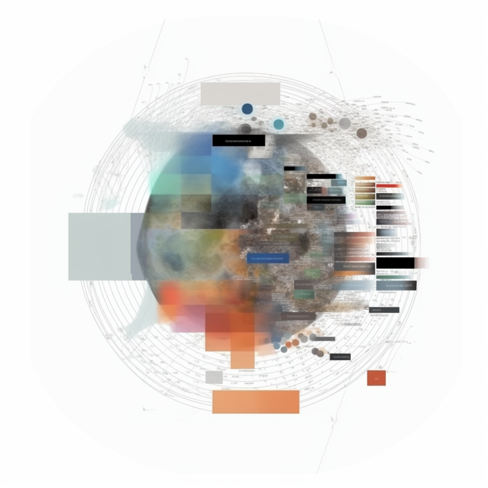
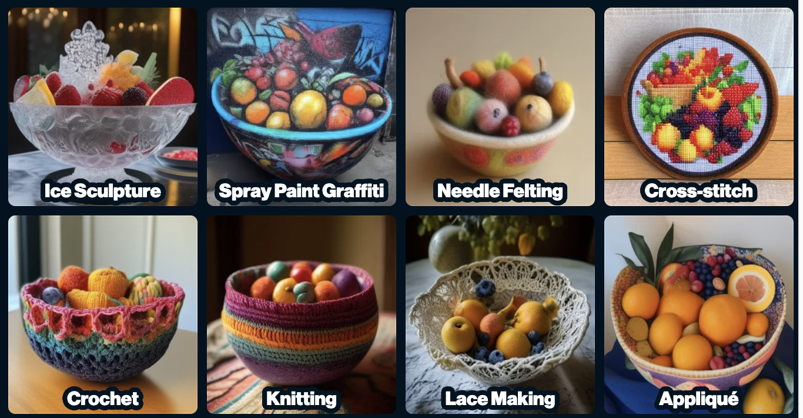
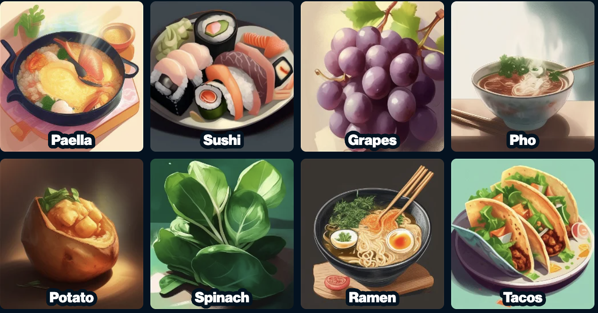

### Interactive Prompt Book

<video src="Screen Recording 2023-07-29 at 11.35.30 PM.webm" muted autoplay loop alt="inchworm" style="margin:auto; display:block; max-width:100%"> </video>

Last week, I contributed a new interactive prompt library for Artbreeder's image generation tool, [Mixer](https://www.artbreeder.com/create/mixer). It's an interface that allows your to build up an image by browsing and clicking buttons to combine ideas, instead of by writing free-form text prompts.

Image models fascinate me, and I've been especially curious by how rudimentary our existing text-based interfaces with them are. This was a quick project, but it's reaching towards an itch I've had for a while, so I wanted to write down some thoughts.

#### CLIP

The most fascinating thing about modern diffusion image generation to me has been trying to wrap my mind around part of the system that allows it to understand text -- CLIP. 

CLIP is a big part of the magic behind text-to-image prompting - it's a model that compresses huge chunks of the internet into a high-dimensional embedding space. CLIP is a representation of the internet, and engaging with it means new ways of understanding the internet.

My personal image of CLIP is that it's like all the images on the entire internet were blended up and clustered in a cloudy mass. Unfortunately, we don't get to look at a picture of CLIP, we can only probe into it and see pieces. Prompts act like addresses of points within that swirling mass - and diffusion models act like a camera to develop a "photograph" of what lives here. 

Image models hold the a microcosm of the whole internet, but only surface a small fraction at a time - acting as "projective surfaces" or even as Rorschach tests for the person interacting with them. Each person sitting down in front of a blank text box will summon totally different imagery -- a reflection of both what floats easily to the top of their minds, and of their personal vocabulary around visual culture.

Prompting requires you to know what you're looking for, and know it by name. There aren't affordances for discovery, browsing, or wandering. 

This also means that a person with energy and excitement, (perhaps a kid), can't easily explore this space - each region of the model is entirely invisible until you know the words to summon them. 

I want interfaces for exploring regions of CLIP without needing to know that something exists and know it by name.

Mixer itself is based on the metaphor of blending ingredients. For instance, you can insert two images, they are both converted into CLIP embeddings, and then the model can generate samples of things found in the space you get between them.

This project builds on Mixer, but in addition to inserting images from your hard drive, or writing text prompts, you can browse a *library of prompts* from different categories by browsing and pressing buttons. 

It's inspired by visual encyclopedias and by "prompt books" that collect big lists of prompt-fragments along with example output to help people expand their vocabulary around style, composition, lighting, and color grading. These are all elements of image specification that make a big difference in your control, but are outside the direct expertise of most people. 

So, to build a fantastic prompt library, that would allow people to explore visual ideas, I just needed to enumerate and catalog every possible visual concept! 

Ironically, I've ended up with the same problem I started with  - each person has only their own slice of knowledge, and so if I were to make this on my own, it would just be a representation of the categories and parameters that I can remember exist. That might be useful to some people, but it's not exhaustive.

Unfortunately, when something is presented as an interface, it is usually interpreted as a _definitive_ catalog, so there's a lot of pressure not to leave things out.  

Language models made for a really useful research assistant and linguistic multitool while patching together the ~2500 item JSON file. Nudging the models to producing good lists of items was interesting, and I took slightly different approaches for each category, with variable results. Usually what worked best was providing examples and asking the model to extrapolate those into a much longer list. 

Each item has 
a title:
	"Crayon", 
a prompt: 
	"Wax crayon drawing illustration like a child's drawing.", 
*and* a thumbnail prompt: 
	"a toy boat bath toy drawn in Wax crayon drawing illustration like a child's drawing".

The distinction between the prompt that you would use as an ingredient, and the prompt for generating the thumbnail was a bit subtle to me at first. It became apparent that when browsing a category of styles, the images are easier to compare with less visual fatigue if they share a common subject matter. The goal is for it to feel like perusing a box of candies, not a train-wreck. BUT - when you add that style (like crayon illustration) into your image, you don't want to also pull in the example subject (like a toy boat) from the thumbnail image. 

Conversely, noun-based categories are easier to compare if they share a common style, but you don't necessarily want to pull that style into your mix.

I generated thousands and thousands of low-res thumbnails while figuring out these subtleties and tamping down each categories thumbnails to be visually parseable and produce useful prompts. Fleshing out each new category was a fun feedback loop with a lot of copy-pasting and scripting calls to language models and Artbreeder's rendering services. I was definitely experiencing a bit of tetris effect each evening after scrolling through thousands of AI-generated thumbnails.

Building out tools that allow for collaborative curation of a prompt library over time would be the right next step for it to grow in size and be more representative. I put this out in an imperfect state because I think it's fun and useful, and I want prompting to be more accessible as a way to learn and explore things that outside of what you already know. But I do take seriously the responsibility for a tool to be intentional on what it includes and what it occludes. A prompt library could be a million times better if each category was curated and written collaboratively by domain enthusiasts. 

I think that with appropriate tooling, and curation, a catalog like this could be massive while still being easy enough to browse in a way that would be a really special resource for prompters and curious people! 

Exploring this idea through collaboration with Joel and Artbreeder was really ideal. We were able to put the whole thing together, do an in-person playtesting workshop, and then release it to the community in less than a week, thanks to leveraging so existing infrastructure in Artbreeder.

I really believe that image prompting can be a positive social communication tool, and it suffers a bit right now from the interface. Sitting in a room of people and collaborating on prompts was really interesting and evocative of each individuals energy and interests. 

#### appendix/links:

https://en.wikipedia.org/wiki/On_Exactitude_in_Science

[ "Prompt under-specification is an abdication of potential authorship."](https://twitter.com/graycrawford/status/1600960539156283393)

https://dallery.gallery/wp-content/uploads/2022/07/The-DALL%C2%B7E-2-prompt-book-v1.02.p)

