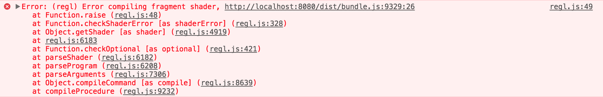

"Computer Art" is an oxymoron.

Not to say that computers don't have their own beauty, or that wonderful, important, heartbreaking art hasn't been made with, by, or about the lovable thinking rocks - It's just that there is a fundamental aspect of computation which defies human expectation and expression.

My day job is helping to record and report when computers do things which defy the expectations and desires of the people who programmed them and rely on them. If you spend your time on a similar pursuit, it won't surprise you when I say that "failure" is the default state of computers. Computers have precisely zero interest or proclivity to carry out tasks that humans desire of them or define as success.

I don't think it's wrong to say that a brush desires to make a mark on a canvas, in a way that computers do not.

<!--
Huge amounts of human energy have gone into building the computer systems into a vast system of intention, action, and information. Most of this effort has be motivated by the desire to produce machines which will reliably an efficiently record commercial transactions. -->
 <!-- Computers are systems shaped by humans and most of the tools, norms, and behaviors that have been etched into them have been formed to facilitate building and running programs which will -->

"Impedance mismatch" is one of my favorite bits of computer jargon — borrowed from electrical engineering where it means a disconnect between the levels of resistance and frequency response between a power source and a load — In software, it means (to me) a situation in which the requirements of one system do not fit the capabilities or expectations of another, be that on a scale of volume or time.

Art is about life. Life contains (among other things) order, algorithms, logic, systems, frustration and computers, and so these things are part of the world of interesting things to make art about.

This doesn't mean that a computer will help you in this pursuit. Many of the tools, norms, cultural baggage, and behavior computers come with are not suited for the act of exploratory whimsy, creativity, and freedom of expression.

There is an impedance mismatch between the way computer are taught to behave, the ways we learn to use them, and the task of expressing creative ideas fluidly and honestly. I spend a lot of time trying to get better at using computers. In many ways, using computers in the thoughtful, responsible, "correct" manner that is necessary to produce useful things for other people don't map to an effective or enjoyable process for creative modes of computation.

Art doesn't need to be easy, but it would be nice if the hard part of making it was the interesting part and not the yaks^[[Yak Shaving](https://en.wiktionary.org/wiki/yak_shaving_)].

Anyway, here's a render I made when I accidentally defined a completely nonsensical signed distance function and my ray marcher dutifully simulated rays of light and record them to a file in the form of thousands of numbers, anyway. I think it looks cool.

