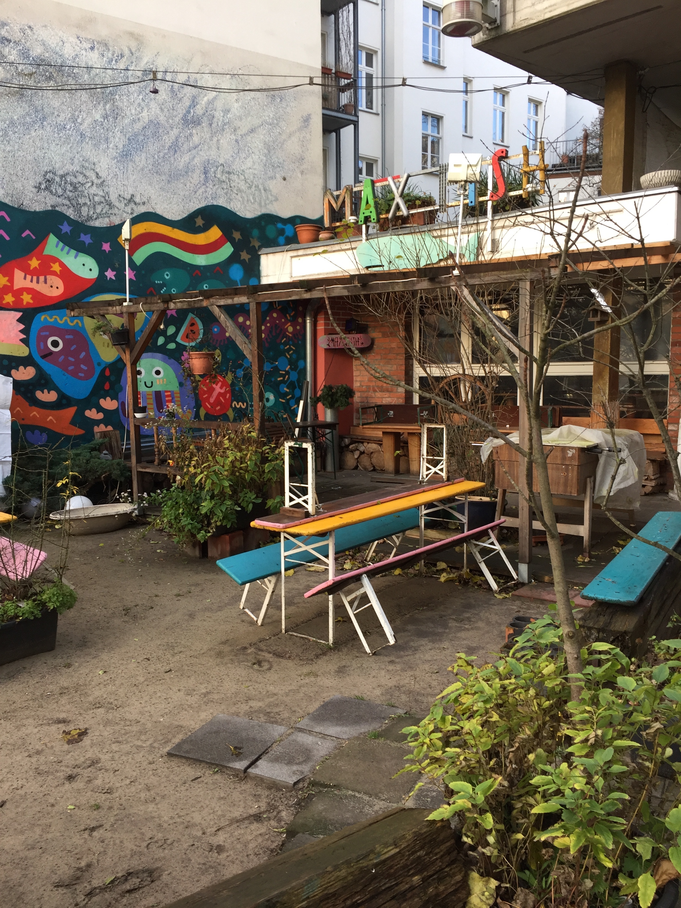
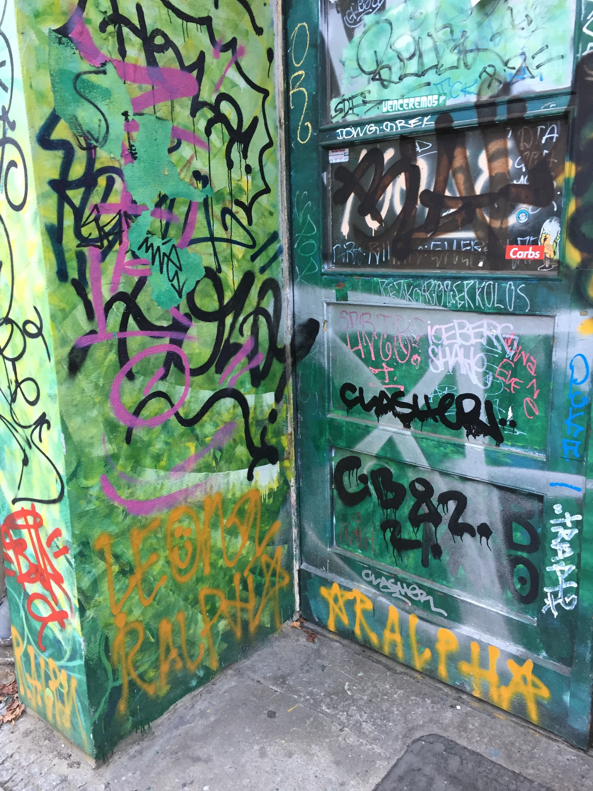

> "There are many side-effects that the artist cannot imagine. These may be used as ideas for new works." - Sol Lewitt, 1969

I'm in Berlin for the first time in my life! Compared to North America, the pigeons look the same, but the crows look different. It's cold and wet and the streets are beautiful and crammed with masonry, signage, posters and tags.

There are lots of hip-looking parents biking their bundled up tots around the neighborhood. An industrial noise show featuring two hunched figures grunting into WW1 gas masks took place in the bar below the workspace last night.

    
    
    

Along with widening my narrow world experience and trying out my high-school german (es ist schlecht), I'm here to hang out with some Recurse Center alumnus in a cozy studio for a week and make computer art! It's a wonderful opportunity and I'm thankful + excited to learn from people here and devote time to making confusing, useless, and (hopefully) beautiful but at least entertaining things.

    
    
    

Because of the limited time I have here, I'm going to try to stick to tools that I'm familiar with and yaks I've already shaved, so this means webgl, regl, clojure and svg. These tools have their own interesting limitations, but I'm feeling inspired by those more than constrained. Fragment shaders are very terse and may be the tool with the richest or densest possibility space I've ever used, by which I mean mistakes and bugs really frequently turn out interesting and fruitful. Cool unexpected emergent behavior / bugs may be one of my favorite parts of making art with computers. Life existing on earth is a cool bug.

Documenting my process and sharing art and code are another goal I have while I'm here, inspired by [Sher Minn's blogging](http://piratefsh.github.io/2017/12/03/rc-computer-art-pop-up-weekend-reflections.html). Look out for more posts and some things you can play with!

One last note is that short feedback loops are awesome, more than just efficiency, they change how you work. People talk about this a lot with regards to live building/reloading tools like figwheel and webpack, but I've been trying to extend it to my source control and design-space exploration using [a custom script](https://github.com/maxbittker/gitsnaps)
to

1.  Take snapshots of directory state + code output, and store them as git commits
2.  Build galleries of these checkpoints + commit SHA1s

This makes it fast and low friction to explore ideas, delete code, and return to previous ideas. I'd love to take the tool a step further to output a gallery of live examples instead of static images, but I'll consider this week to be UX testing of it's current capabilities and my needs. Here's some example output for my [webgl experiment repo](https://github.com/maxbittker/regl-experiments), I expect to see this list grow over the course of the week!

