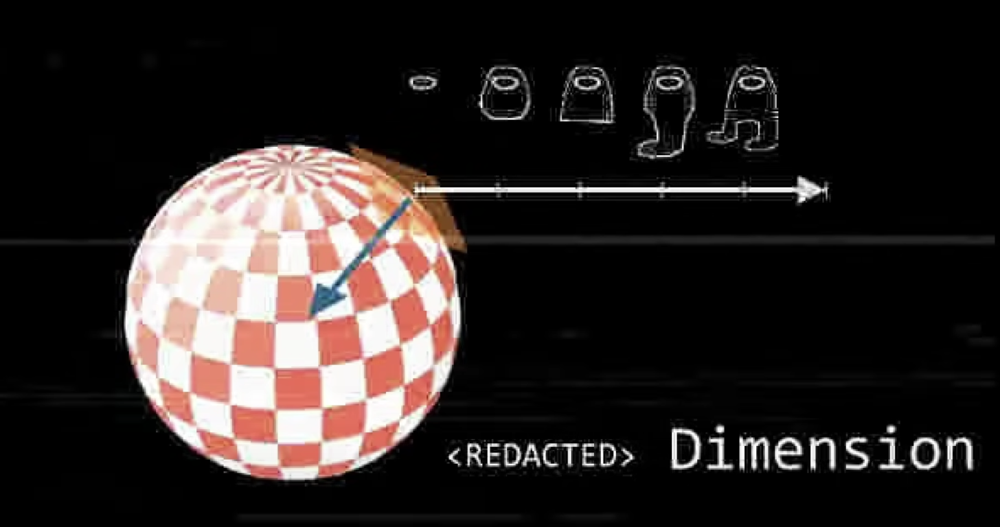

River is an immersive exploration engine for wandering through visual culture. [Try it out](https://river.maxbittker.com)

This post is a place for me to put down some notes on the design and technical architecture.

### Feelings on the state of Diffusion:
The leap forward in generative ai and associated control techniques has been fascinating to experience as a tool maker. 

When something is this new, it's not clear which limitations are incidental and which are innate, posing interesting challenges for interface design. How should we make good tradeoffs when the underlying capabilities change so quickly? 

It makes sense that we end up with tools like Midjourney (opinionated and minimal) or Automatic1111, an evolved mess of nested tabs and options that does everything (if you can manage to tape together a working permutation of weights, plugins, LORAs and parameters).

Beyond that, I find that these tools lack the sturdiness and control required for developing a deeper sense of craft - still feeling more like a slot machine and less like a pencil.

Four deficiencies of diffusion that nag me:
1) Reliance on discrete language and named ideas, versus continuous exploration
2) Diffusion is slow and doesn't work at the speed of thought, pulling you out of flow state 
3) Artificial images are disposable and unmoored from concrete grounding in cultural context. It makes each individual image less useful as a shared meeting point.
4) Alienation of source material: laundering references and reheating / amplifying existing biases of the dataset 

For me, River is an experiment in leveraging ML capabilities towards some of the negative space left unexplored by the excitement about text-to-image.

### Curation as Poetry
Tumblr was a formative online scene for teenage me.  My favorite aspect of the community was way that curation was something that everyone played at.  It was normal to have multiple blogs, and registering a single-topic page under a username like "fuckyeahsweaters" , "onlydavidbowie", or "powerlinesinanime" was all you needed to self-deputize as a librarian, taking on the mantle of curating the theme or idea to the best of your ability.  

People took this job seriously! Similar to the art of a good radio jockey - hunting for deep cuts, balancing ingredients, and managing pacing. It's been nice to see this style of playful curation alive and well on instagram accounts like these: 

[@massive.archive](https://www.instagram.com/massive.archive/),
[@markrothko](https://www.instagram.com/markrothko/),
[@dusttodigital](https://www.instagram.com/dusttodigital),
[@nature.is.not.metal](https://www.instagram.com/nature.is.not.metal/), as well as the whole tiktok genre of "corecore".

I'm particularly interested in a brain-feel that these sequences can create. It's a form of internet art that engages our subconscious pattern matching abilities. 

The tracing of an invisible through-line, circling an idea that resists explicit description.

I think that the balance of similarity and difference is key to creating that feeling.

### Mathematics of a Visual Rhyme

Vector embeddings, such as the ones produced by the CLIP library, allow you to project an image into a mathematical space, where it can be compared as a set of numbers. 

Clip-guided diffusion (a la text-to-image) is one way to turn that embedding back into an "hallucinated" image, but you can also do something much simpler - find the nearest neighbor within some dataset of *real* images! 

I was curious about trying to explore the concept of visual rhymes (curated balances of similarity and difference) through vector embeddings.

One formulation of this problem is taking a set of image embeddings and quantifying which dimensions they mostly share in common, versus those that they mostly differ along, and use these ranges to extrapolate the shape of a mathematical volume. You might then sample points from inside that volume to find other images. 

I did a bunch of experiments towards this idea, and had exciting but ultimately inconsistent results.  Doing simple geometric operations on vectors such as adding, subtracting, or averaging them would work well in some toy examples, but behave incomprehensibly when I tried to generalize. 

From what I've read,  this has to do with the lumpy nature of the embedding space created by CLIP's attempt to squish all of visual culture into a 512 dimensional space. 

Within _local_ regions, you can treat this space as euclidean: geometric relationships hold meaning. (you can interpolate smoothly between points, or compute averages) 

But beyond a small local region, these relationship break down. The space has very irregular density, and is "folded up" with overlapping semantics for a given vector.  The meaning you might be able to ascribe to a vector, such as "this dimensions maps to size of the dog, this dimension maps to lighting style" will not hold up globally - they won't be applicable to another region containing images of cars.

Images taken from [Non-Euclidean Therapy for AI Trauma](https://www.youtube.com/watch?v=FQ9l4v7zB3I)

My solution for this problem was to focus only on local comparisons, and use quick repeated hopping to navigate from region to region - a "surfing" metaphor. 

But, still curious to return to some of those more nuanced mathematical relationships between embeddings if anyone has pointers on new ways to model them.

### Infrastructure

I had an assumptions that ML techniques are hard to set up and expensive to run - requiring special knowledge, expensive APIs, or deployment of GPU-equipped machines. It was rewarding to discover how far I could get with well-documented open source libraries running on cheap commodity boxes.

I'm downloading images, and embedding them with a CLIP python library (turning them into 512 floats). CLIP is pre-trained, and only takes around 200ms to embed an image using a CPU! 

These embeddings are then stored in a Postgres table using the  `pgvector` extension, a really handy open source tool that supports different query patterns and indexes. 

There are bunch of proprietary vector database solutions competing for market share right now. I'm sure that there will be good ideas from this field, but I would personally recommend anyone already familiar with SQL to reach for `pgvector` first. (And if you're a frontend person who feels shy about writing SQL, GPT4 is incredibly useful for writing queries if you provide your schema)

### Connections 

This tool operates as a super-connector, helping you rapidly browse and find things by chaining fuzzy connections. Those discoveries are only really valuable if you can follow the thread back into the domain of real world. I tried to use datasets that could be traced back to real people or curatorial contexts – so that when you find "gold", you can follow the trail out of the latent space and connect with real humans. 

For instance, the first image set I embedded was images posted to the social media site Bluesky. I used this to build a feed called "Surf" on the service (Bluesky supports content-curation algorithms). The beauty was that when you found images, they're connected to a specific post by a real user - giving you the ability re-share, follow, ask questions, or otherwise support their work.

Bluesky people enjoyed the feed and called out this specific use-case! 

As I experimented with ways to navigate the space more widely and rapidly, cruising through vast regions of Bluesky images started to feel too voyeuristic (like flying a drone over someone's back yard).
  
I embedded a new dataset of ~1 million images from the site [are.na](https://are.na). Are.na hosts the creative research of a lot of talented designers and artists with broad and developed tastes, which makes navigating from region to region highly rewarding. This was when the tool really started to click with me, and I found myself totally sucked in.

### Latent-Space Flow-State  
I was struck by the powerful feeling of *movement* through the data – recognizing landmarks,  following gradients, escaping attractors, or stumbling suddenly into new regions – it all felt immersive and game-like.

William Gibson novels have a recurring character archetype with the ability to project their consciousness into the world of data. Blessed (and cursed) to navigate the infosphere intuitively and see patterns, or to follow invisible threads. 

Iteratively traversing the embedding space gave me a similar sensation, and I wanted to play into that feeling with the design of the tool. 

This meant tuning up the backend to be fast, and making most of my design decisions on the frontend with the goal of sensory feedback to help you "stay in the zone". The layout tries to maintain your bearings by preventing re-flow as the images load in, and the sound effects that trigger when an image finishes loading provide bits of feedback on the underlying machinations of the data-fetching (For instance, pages you've visited recently sound different than fresh ones, because the images are already cached).

### Loose threads: 

Many playtests include people getting sucked into "gravity wells" - areas of the embedding space that are dense & strongly self-connected, making them harder to walk out of. If you've used the tool long enough, you likely have found yourself trapped for some period of time within a labyrinth of reaction jpgs, interior design photoshoots, or minimalist monochrome logotypes. I did some manual work pruning and thinning certain regions of the dataset to try to mitigate this feeling, but there's a lot more that could be done to regularize the density of different regions. 

People seem to particularly enjoy the feeling of searching through the landscape for a certain goal, like the "wikipedia game", and it would be fun to flesh out gamified layers of the tool, like daily challenges.

I'm also fascinated by the social potential of meeting the like-minded souls who show up in the same locations as yourself in nodal space. What would it be like to make a new friend by running into each other at the intersection of egyptology and acid house rave posters, or to find a note pinned to the wall in a hallway of antique digital wristwatch adverts? 

I also should say that while this interface provides a unique view onto are.na's data, it would be nice to layer back in some of their wonderful human curation, and allow you to travel smoothly along the organically defined channels in addition to the embedding-based connections. 

### One more thought: 

So much internet now is one dimensional scrolling. We don't get to rudder our own boat, we go downstream to wherever the algorithm predicts we might find "most engaging". Let's bring back the feeling of surfing, and empower each other with the ability to navigate and make our own decisions. 

Thanks for reading these notes! I would love to see things you find in the tool, I have a channel on are.na, (found in the river)[https://www.are.na/max-bittker/found-in-the-river] that you're invited to add things to.
