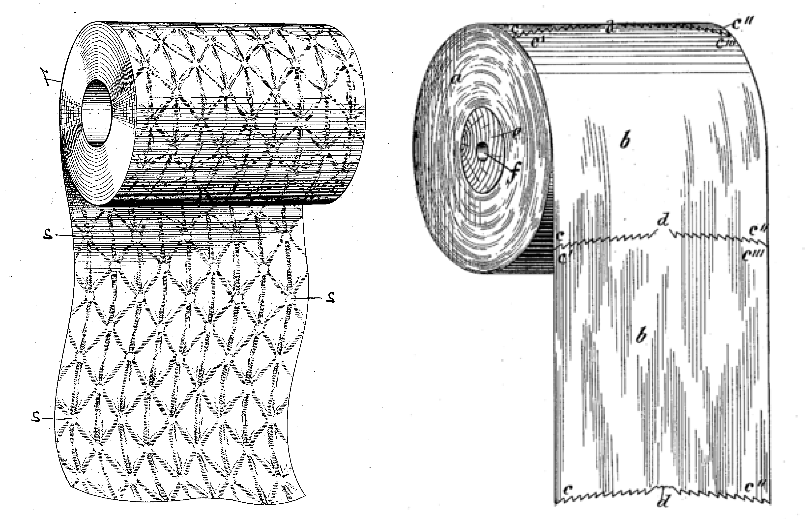
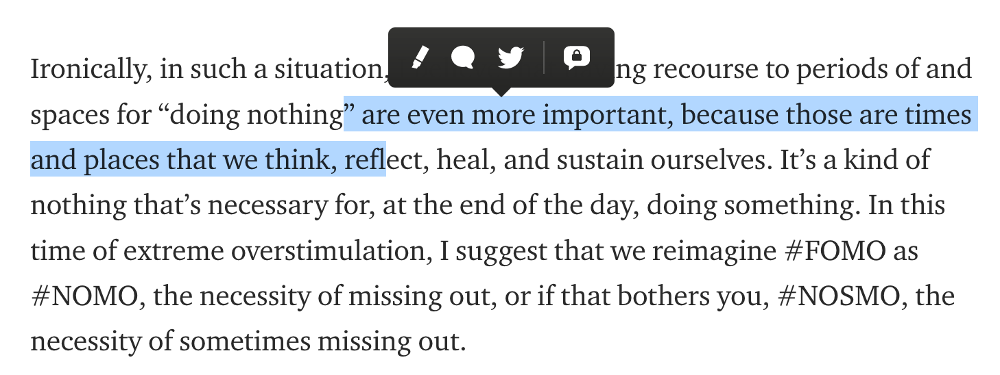

Any public place where programmers are allowed to comment on hyperlinks will be about 15% page design critique.

Making good webpages is a hard design task. The requirements are sometimes competing and often invisible to you as the designer. Finding a form which fits all needs is a matter of minimizing pain and never succeeding for everyone.



It's only understandable that both thoughtful amateurs and large teams of experienced people frequently build sites which are a poor fit for the needs of some portion of the people using them.

There are many cases in which highlighting poor tradeoffs is useful and important, particularly when they favor vanity, metrics, or advertising over people's basic need to reach the information being shared. ^[[_Accessibility Guidelines_](http://accessibility.voxmedia.com/): helpful checklist and resource aggregation on making pages functional for everyone.]

However, when it's not a matter of accessibility, complaining about web design is probably a waste of energy.

That said — these things can be really irksome! If you use the internet, there are times when a website you like or need does one thing that itches at you like the tag on a cheap novelty t-shirt.

For instance, I find it ironic that twitter.com, built by the company who created bootstrap, does this when given less than a full screen. ^[Twitter does in fact have a low-bandwidth responsive site at m.twitter.com]

<div style="display:inline-block; margin:auto; width:100%">

</div>

This is the kind of thing that is easy to make fun of, and lots of time is already spent doing so. But luckily, if you know a bit about HTML and CSS selectors^[If you don't, you can find some helpful resources [here](https://developer.mozilla.org/en-US/docs/Learn/Getting_started_with_the_web)], you have another course of action: scratch your own itch with custom styles!

There are a long lineage of browser extensions^[Some popular feature-packed ones include Stylus & Stylish, and some more minimalist ones include "Custom Style Script" and "Control Freak" (Chrome only)] which allow you to write, inject, (and sometimes share) custom style rules and scope them to domains or URLs. These present a fun excuse to pop open the developer tools, poke around the DOM, and mess with things!

Here's what I came up with to improve the behavior of twitter on small screens:

```css
/* Injected onto all twitter.com/ pages: */
@media (max-width: 750px) {
  .dashboard {
    display: none;
  }
  #timeline {
    width: 97vw;
    float: none;
  }
}
```

Which results in:

<div style="display:inline-block; margin:auto; width:100%">

</div>

Possibly not a good use of your time. But in my opinion, taking control of your own browser like this is educational, weirdly satisfying, and better than complaining into the void.

What's more, subtle (or flagrant) vandalism of pages that you'd appreciate reminders to spend less time on is a healthy outlet! ^[One nice example of vandalism would be [Chas Emerick's ancap-news](https://github.com/cemerick/ancap-news)] If you spend lots of energy trying to make interfaces look good, it's therapeutic to screw someone else's up every once in a while.

Once you have a tool like this set up, lots of things start to look like nails! A few more examples I'd like to share:

Ever had this header on reddit trick you into consuming viral content you'd rather leave out of your media diet?


Rub some `hidden` on it!

```css
#sr-header-area {
  visibility: hidden;
}
```

Compulsively highlight text while reading, and don't care for Medium's engagement driving tooltip fluttering around between you and the text?


<small>
Jenny Odell^[Excerpt from [Jenny Odell's how to do nothing](https://medium.com/@the_jennitaur/how-to-do-nothing-57e100f59bbb)]
</small>

Try this on for size!

```css
.highlightMenu {
  display: none !important;
}
```

Be creative! Be spiteful! Have fun! Shoot yourself in the foot weeks later when your own poorly scoped selector hides important buttons!
